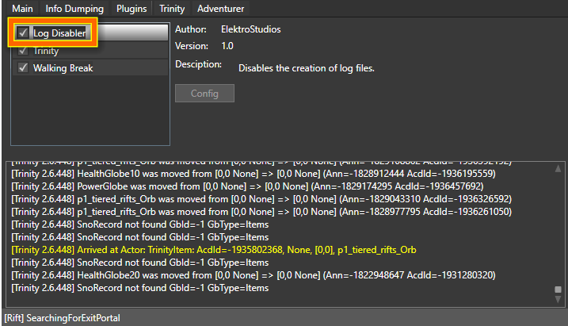

# LogDisabler plugin for DemonBuddy

**LogDisabler** is a plugin for **DemonBuddy** (a bot for **Diablo III** videogame),
on which you can use this plugin to disable the creation of log files.

**DemonBuddy** performs thousands and thousands of I/O disk write operations in short periods of time for writing log files; this can reduce the life of your hard-drive and also can cause an overall negative performance impact on your system if other programs are requesting to perform other I/O disk operations simultaneously. 

If you don't need to manage the log files created by **DemonBuddy**, then there is no good reason why you are allowing **DemonBuddy** to create these logs. The problem here is **DemonBuddy** does not provide a built-in feature to disable log file creation, and this is why you should use **LogDisabler** plugin. 

------------------------

# Screenshots

------------------------

# Donations

To support me, maybe you would like to consider buying 'DevCase for .NET Framework', a powerful set of libraries for .NET developers.

Here is a link to the purchase page:

    https://codecanyon.net/item/elektrokit-class-library-for-net/19260282

Thank you.
